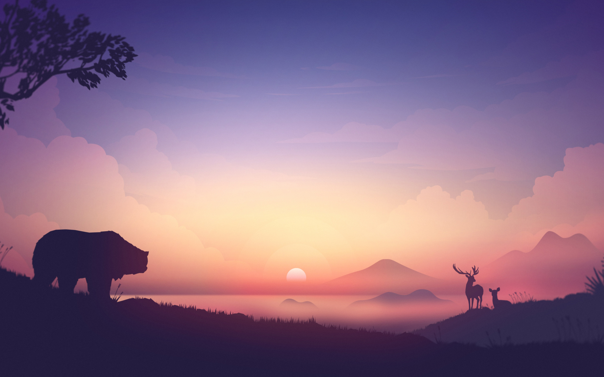
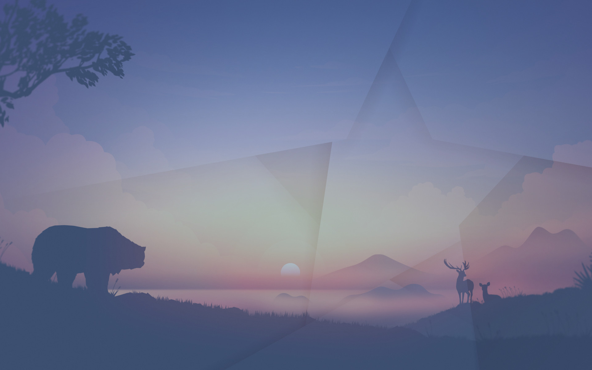
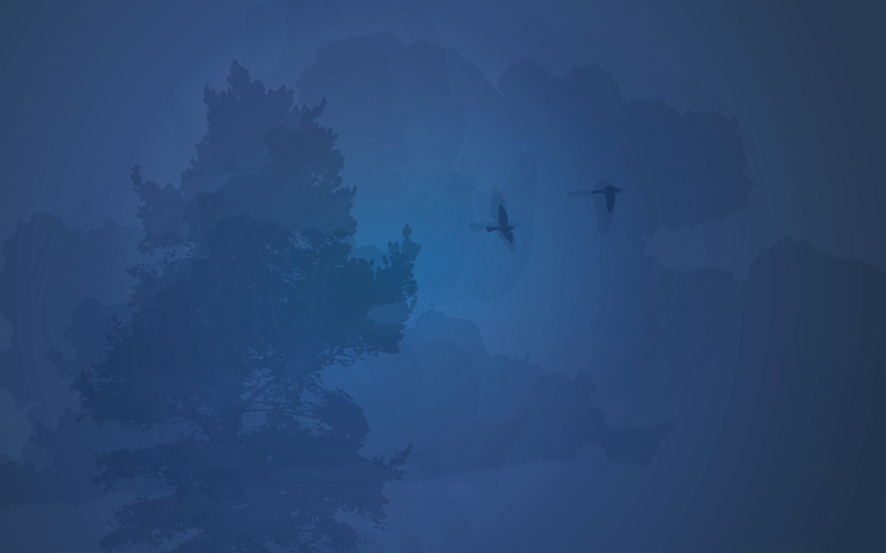

# День

## Фон

### Восход

Встаём вместе с солнцем в 4 часа утра в течение 2 часов


### Утро

Утро начинается в 6 часов, длится в течение 5 часов и заканчивается в 11 часов


### День

День начинается в 11 часов, длится в течение 6 часов и заканчивается в 17 часов


### Вечер

Вечер начинается в 17 часов, длится в течение 5 часов и заканчивается в 22 часа


### Ночь

Ночь начинается в 22 часа, длится в течение 6 часов и заканчивается в 4 часа


## Установка

Тема для Gnome

```bash
git clone https://github.com/doomkin/day-cycle.git
cd day-cycle && sudo ./install.sh
```
